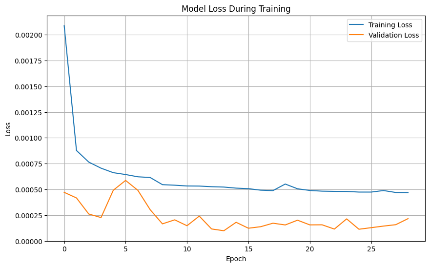
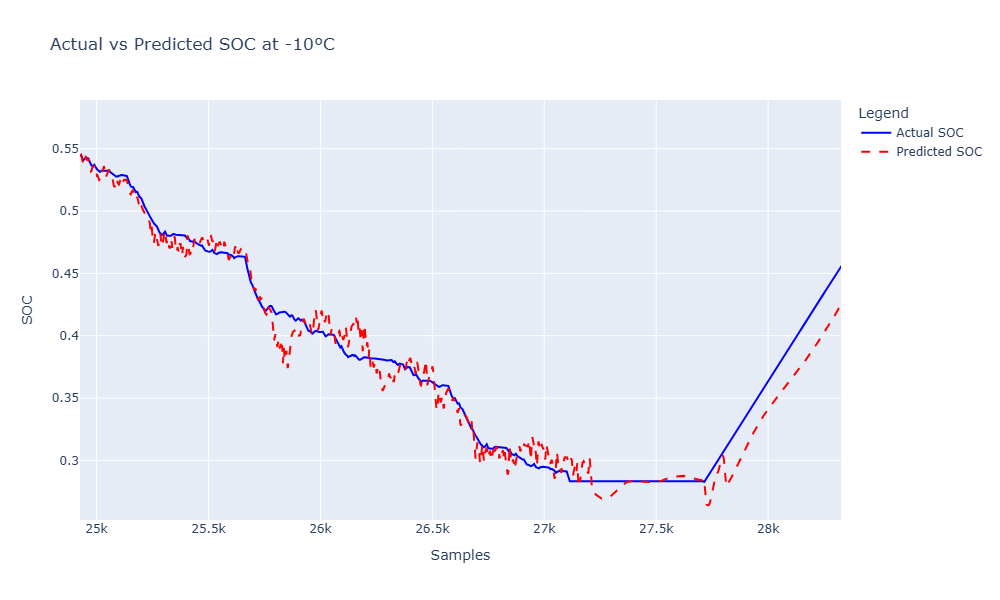
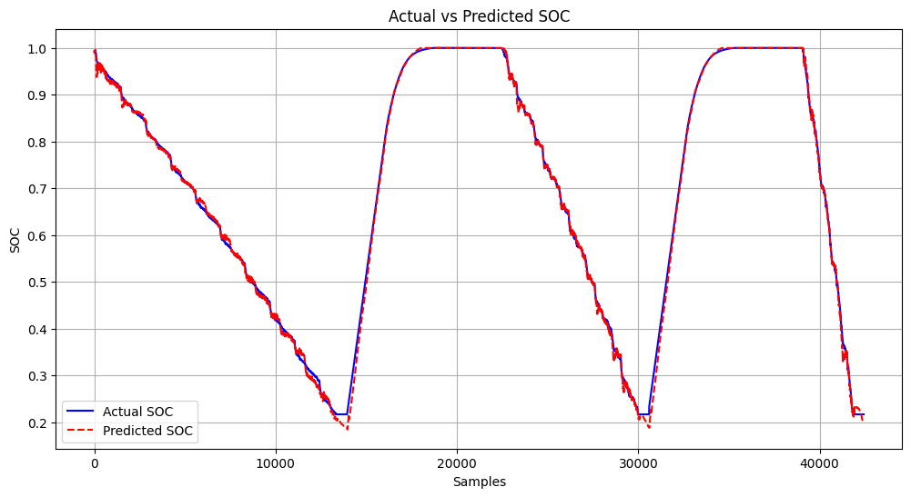
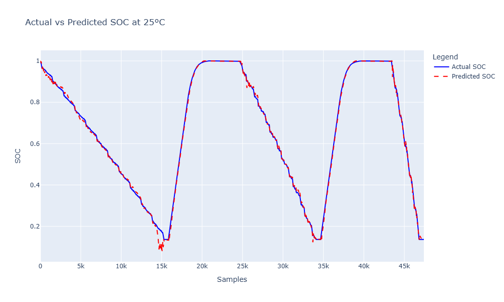
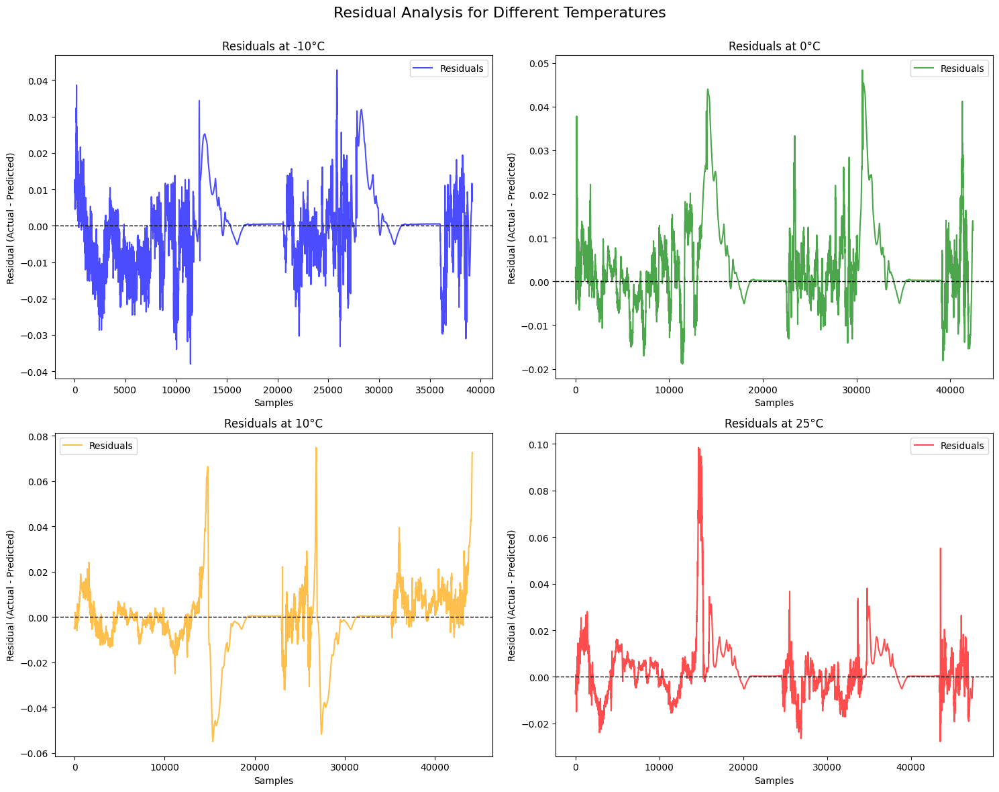

# 🔋 SOC Estimation using ConvLSTM

This repository implements a **ConvLSTM-based model** for **State of Charge (SOC) Estimation** in Lithium-ion batteries. ConvLSTM combines the strengths of convolutional and LSTM architectures to model both spatial and temporal dependencies, achieving highly accurate SOC predictions.

---

## 📖 Motivation

Accurate SOC estimation is critical for optimizing battery performance, lifespan, and safety. While traditional **Temporal CNNs** and **LSTMs** were successful in modeling battery data, we wanted to explore whether a **hybrid architecture like ConvLSTM** could further improve prediction accuracy.

### 💡 Why ConvLSTM?

#### 🚀 Previous Models:
- **Temporal CNN**: Efficient for local temporal features but struggled with long-term dependencies.
- **LSTM**: Good at capturing temporal dependencies but lacked spatial feature extraction capabilities.

#### 🔄 ConvLSTM Advantages:
1. **Hybrid Design**:
   - Integrates **Convolutional layers** for spatial features and **LSTM** for temporal learning.
2. **Enhanced Accuracy**:
   - Achieves the lowest error metrics among tested architectures.
3. **Robust Performance**:
   - Reliable results across diverse operating conditions.
4. **Reduced Noise**:
   - Superior at minimizing fluctuations during rapid SOC transitions.

---

# 📂 Project Structure

The **SOC Estimation using ConvLSTM** project is organized as follows:

- **`data/`**  
  - Contains the input datasets for training, validation, and testing.
  - Organized into subfolders:
    - `train/` - Training datasets.
    - `validation/` - Validation datasets.
    - `test/` - Test datasets.

- **`models/`**  
  - Stores trained model files and checkpoints.
  - Example:
    - `convolstm_model.keras` - Best ConvLSTM model.

- **`notebooks/`**  
  - Includes Jupyter notebooks for exploratory data analysis and prototyping.
  - Example:
    - `data_analysis.ipynb` - Dataset exploration and preprocessing.
    - `training.ipynb` - Model training and evaluation workflow.

- **`scripts/`**  
  - Contains Python scripts for reproducibility.
  - Example:
    - `train.py` - Script for training the ConvLSTM model.
    - `evaluate.py` - Script for model evaluation and metrics calculation.
    - `plot_results.py` - Script for generating plots.

- **`results/`**  
  - Saved plots and metrics for analysis.
  - Organized into subfolders:
    - `training_loss.png` - Training and validation loss plot.
    - `residual_analysis/` - Residual plots across different temperatures.
    - `soc_predictions/` - SOC prediction plots for various temperature conditions.

- **`README.md`**  
  - Contains the project documentation, including descriptions, results, and insights.

- **`requirements.txt`**  
  - Lists all the dependencies required for running the project.

- **`LICENSE`**  
  - Contains license information for the project.

- **`.gitignore`**  
  - Specifies files and folders to be ignored by Git.

---

## 🏗️ Model Architecture

### Input Data:
- **Sequence Features**: Voltage, Current, Temperature, SOC Rolling Average, Current Rolling Average.
- **Target**: State of Charge (SOC).

### ConvLSTM Model:
1. **Input Layer**:
   - Accepts sequences in the shape `(samples, time steps, rows, cols, channels)`.

2. **ConvLSTM Layer**:
   - Extracts spatio-temporal features.

3. **Dense Layers**:
   - **Dense Layer 1**:
     - Units: 64, Activation: ReLU, Regularization: L2.
   - **Dropout Layer 1**: Rate: 0.3.
   - **Dense Layer 2**:
     - Units: 32, Activation: ReLU, Regularization: L2.
   - **Dropout Layer 2**: Rate: 0.3.

4. **Output Layer**:
   - Units: 1, Activation: Linear (SOC prediction).

### Model Compilation:
- **Loss**: Mean Squared Error (MSE).
- **Optimizer**: Adam with learning rate `0.001`.
- **Metrics**: MAE, R².

---

## 📉 Training Loss Analysis

The training and validation loss plot provides critical insights into the model's learning behavior during the training process.



### Observations:
1. **Initial High Loss:** 
   - The training loss starts at a relatively high value, reflecting the initial randomness of the model weights.
   - The validation loss decreases rapidly in the initial epochs, indicating the model is learning useful patterns.

2. **Smooth Decrease in Training Loss:** 
   - The training loss steadily decreases as the epochs progress, demonstrating the model's ability to optimize its parameters effectively.

3. **Validation Loss Stability:**
   - The validation loss stabilizes after approximately 10 epochs, with minor fluctuations, indicating that the model is reaching a point of generalization.

4. **Overfitting Risk:**
   - In the later epochs (20–25), the validation loss begins to increase slightly, while the training loss continues to decrease. This may suggest early signs of overfitting.

### Conclusion:
The training plot highlights the efficiency of the ConvLSTM architecture in learning temporal and spatial dependencies for SOC estimation. However, early stopping and regularization strategies are critical to avoid overfitting and improve generalization on unseen data.


## 📊 Results and Insights

### Overview
The **ConvLSTM** model was evaluated for **State of Charge (SOC)** estimation under various temperature conditions: **-10°C, 0°C, 10°C, and 25°C**. The results demonstrate the model's strong performance and improvements over previous approaches. Below, we provide detailed metrics, visualizations, and insights.

---

### 🏆 Performance Metrics

| 🌡️ Temperature | 📉 MAE (Mean Absolute Error) | 📊 MSE (Mean Squared Error) | 📈 R² (R-squared) | 🔄 RMSE (Root Mean Squared Error) | 🎯 Average Error (%) |
|-----------------|------------------------------|-----------------------------|-------------------|-----------------------------------|---------------------|
| -10°C          | **0.006861**                 | **0.000099**                | **0.998376**      | **0.009948**                      | **0.6861%**         |
| 0°C            | **0.0064**                   | **0.000100**                | **0.998500**      | **0.010000**                      | **0.64%**           |
| 10°C           | **0.008792**                 | **0.000218**                | **0.997099**      | **0.014764**                      | **0.8792%**         |
| 25°C           | **0.007124**                 | **0.000153**                | **0.998181**      | **0.012368**                      | **0.7124%**         |

---

### 📉 Visual Results

#### 🔍 -10°C (Zoomed-In Instabilities)


#### 🌡️ 0°C


#### 🌡️ 10°C


#### 🌡️ 25°C


---

### 🔍 Key Insights
1. **Error Reduction**:
   - The **ConvLSTM** outperformed previous models (**Temporal CNN** and **LSTM**) that had an average error rate of **1.4%**.
   - The **ConvLSTM** achieved an **average error of 0.7%**, representing a substantial improvement.

2. **Challenges at -10°C**:
   - **Observation**: At **-10°C**, fluctuations appear during low SOC regions, as shown in the zoomed-in plot.
   - **Analysis**:
     - Likely caused by **limited training data** at extreme temperatures.
     - Sensor noise or inaccuracies at low temperatures might have affected predictions.
   - **Recommendations**:
     - Enhance the training dataset with more low-temperature samples.
     - Explore **temperature-specific fine-tuning** or **data augmentation** for extreme conditions.

3. **Stability Across Other Temperatures**:
   - The model exhibited consistent accuracy at **0°C, 10°C, and 25°C**, ensuring smooth SOC predictions during charging/discharging cycles.

4. **Hybrid Architecture Advantage**:
   - Combines **spatial feature extraction** (via convolutional layers) with **temporal learning** (via LSTMs) to address complex SOC dynamics.

---

### 🔍 Residual Analysis Across Temperatures

Residual plots for SOC estimation reveal the performance of the ConvLSTM model across different temperatures:

#### 📊 Observations:
1. **-10°C:**
   - Residuals show high variability and larger deviations.
   - Indicates model struggles due to non-linear battery behavior in extreme cold.

2. **0°C:**
   - Moderate fluctuations, with residuals mostly centered around 0.
   - Some spikes indicate occasional prediction errors.

3. **10°C:**
   - Stable residuals with minor deviations, showing consistent model performance.
   - Rare outliers are observed but do not affect overall accuracy.

4. **25°C:**
   - Residuals are the most stable with minimal fluctuations.
   - Best performance, reflecting predictable battery behavior at standard conditions.

#### ⚡ Insights:
- **Best Performance:** At moderate temperatures (10°C and 25°C), residuals are minimal, highlighting model robustness.
- **Challenges:** At -10°C, higher variability suggests a need for improved handling of extreme conditions.

#### 📉 Residual Plots:


#### 🔧 Next Steps:
- Incorporate temperature-specific features or data augmentation for extreme conditions.
- Analyze outliers to further enhance model performance.

This analysis emphasizes the need for temperature-aware optimization to ensure reliable SOC predictions under diverse operating conditions.

### Training Curve
The training and validation loss over 40 epochs are shown below:


#### Key Observations:
1. **Rapid Convergence**: The training loss dropped steeply during the initial epochs, indicating effective learning.
2. **Stabilization**: Both training and validation loss stabilized after ~10 epochs, demonstrating a well-trained model.
3. **Generalization**: The small gap between training and validation loss highlights robust generalization to unseen data.

> **Note**: The use of Bayesian CNN ensures confidence in SOC predictions by quantifying uncertainties, which can further improve safety and decision-making in real-world applications.

Would you like to include more details, such as evaluation metrics or uncertainty examples, in this section?

---

### ✅ Conclusion
The **ConvLSTM** architecture proves to be a reliable and accurate solution for **SOC estimation**. Its ability to generalize across unseen data and maintain high performance under varying temperature conditions makes it a suitable candidate for real-world **Battery Management Systems**.

<p align="center">
  
  <b>ConvLSTM: Pushing the boundaries of SOC estimation accuracy! 🚀</b>
</p>

---

### Conclusion

The ConvLSTM model is a robust and accurate solution for **SOC estimation**, achieving consistent and superior performance compared to Temporal CNN and standalone LSTM architectures. Its ability to handle complex spatial and temporal dependencies, coupled with its generalization across temperature variations, makes it a strong candidate for deployment in real-world battery management applications.

The visual results and metrics highlight its strength in minimizing errors and achieving smooth SOC predictions, with an average error of **0.7%** across all conditions.

---

## 🚀 Usage

### 1. Clone the Repository
```bash
git clone https://github.com/yasirusama61/SOC_Estimation_ConvLSTM.git
cd SOC_Estimation_ConvLSTM
