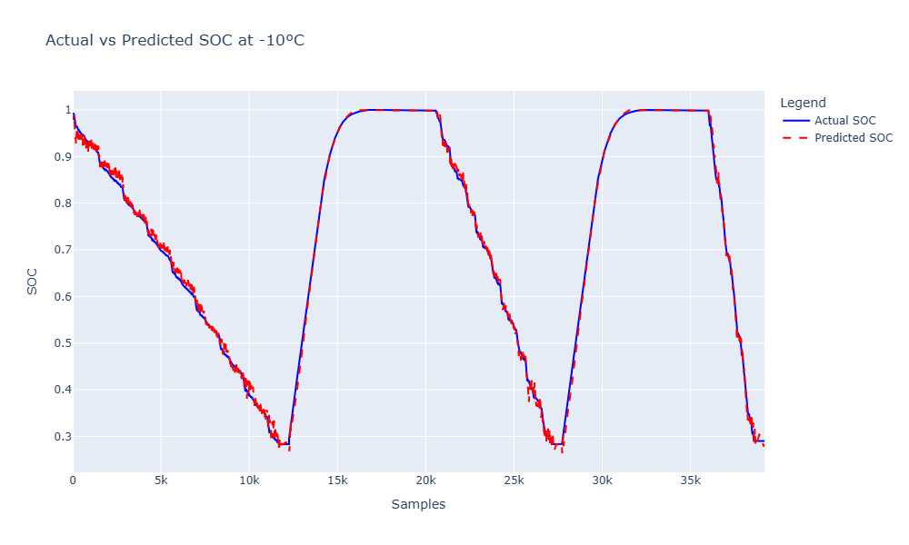

# 🔋 SOC Estimation using ConvLSTM

This repository implements a **ConvLSTM-based model** for **State of Charge (SOC) Estimation** in Lithium-ion batteries. ConvLSTM combines the strengths of convolutional and LSTM architectures to model both spatial and temporal dependencies, achieving highly accurate SOC predictions.

---

## 📖 Motivation

Accurate SOC estimation is critical for optimizing battery performance, lifespan, and safety. While traditional **Temporal CNNs** and **LSTMs** were successful in modeling battery data, we wanted to explore whether a **hybrid architecture like ConvLSTM** could further improve prediction accuracy.

### Why ConvLSTM?
- **Temporal Dependency**: LSTM layers capture long-term dependencies in sequential data.
- **Spatial Features**: Convolutional layers effectively extract spatial features.
- **Hybrid Approach**: ConvLSTM combines both, making it ideal for capturing intricate relationships in battery data.
- **Performance**: With an average **Mean Absolute Error (MAE)** of ~0.0073 across varying temperatures, ConvLSTM outperforms standalone architectures like Temporal CNN and LSTM.

---

## 📂 Project Structure
SOC_Estimation_ConvLSTM/
   ├── data/                      # Input datasets
   ├── models/                    # Trained models
   ├── notebooks/                 # Jupyter notebooks
   ├── scripts/                   # Python scripts
   ├── results/                   # Saved plots and metrics
   ├── README.md                  # Project description
   ├── requirements.txt           # Dependencies
   ├── LICENSE                    # License information
   └── .gitignore                 # Ignored files and folders

---

## 🏗️ Model Architecture

### Input Data:
- **Sequence Features**: Voltage, Current, Temperature, SOC Rolling Average, Current Rolling Average.
- **Target**: State of Charge (SOC).

### ConvLSTM Model:
1. **Input Layer**:
   - Accepts sequences in the shape `(samples, time steps, rows, cols, channels)`.

2. **ConvLSTM Layer**:
   - Extracts spatio-temporal features.

3. **Dense Layers**:
   - **Dense Layer 1**:
     - Units: 64, Activation: ReLU, Regularization: L2.
   - **Dropout Layer 1**: Rate: 0.3.
   - **Dense Layer 2**:
     - Units: 32, Activation: ReLU, Regularization: L2.
   - **Dropout Layer 2**: Rate: 0.3.

4. **Output Layer**:
   - Units: 1, Activation: Linear (SOC prediction).

### Model Compilation:
- **Loss**: Mean Squared Error (MSE).
- **Optimizer**: Adam with learning rate `0.001`.
- **Metrics**: MAE, R².

---

## Results and Insights

### Overview
The ConvLSTM model was evaluated for **State of Charge (SOC)** estimation under various temperature conditions: **-10°C, 0°C, 10°C, and 25°C**. The performance metrics and visual results below demonstrate the model's ability to generalize across different operating conditions, achieving significantly lower errors than previous approaches (Temporal CNN and LSTM).

---

### Performance Metrics

| Temperature | Mean Absolute Error (MAE) | Mean Squared Error (MSE) | R² (R-squared) | Root Mean Squared Error (RMSE) | Average Error (%) |
|-------------|----------------------------|---------------------------|----------------|-------------------------------|-------------------|
| -10°C       | 0.006861                   | 0.000099                  | 0.998376       | 0.009948                      | 0.6861%          |
| 0°C         | 0.0064                     | 0.000100                  | 0.998500       | 0.010000                      | 0.64%            |
| 10°C        | 0.008792                   | 0.000218                  | 0.997099       | 0.014764                      | 0.8792%          |
| 25°C        | 0.007124                   | 0.000153                  | 0.998181       | 0.012368                      | 0.7124%          |

---

### Visual Results

#### -10°C


#### 0°C


#### 10°C


#### 25°C


---

### Key Insights
1. **Error Reduction**:
   - ConvLSTM outperformed previous architectures (Temporal CNN and standalone LSTM), which had an average error rate of **1.4%**.
   - The ConvLSTM model achieved an **average error of 0.7%** across all temperature conditions, a significant improvement.

2. **Consistency Across Temperatures**:
   - The model demonstrated exceptional robustness in SOC prediction, maintaining high accuracy across extreme low (-10°C) to moderate (25°C) temperatures.
   - The lowest error was observed at **0°C**, with an MAE of **0.0064** and R² of **0.9985**.

3. **Smooth Predictions During Transitions**:
   - The ConvLSTM model effectively captured the steep SOC transitions during charging and discharging cycles, reducing prediction fluctuations observed in earlier approaches.

4. **Generalization**:
   - The model’s ability to generalize well across unseen test data highlights its suitability for deployment in real-world **Battery Management Systems (BMS)**.

---

### Why ConvLSTM?

#### Previous Models:
- **Temporal CNN**: Effective at capturing local temporal features but struggled with long-term dependencies.
- **LSTM**: Captured temporal dependencies but lacked the capability to extract spatial features effectively.

#### ConvLSTM Advantages:
1. **Hybrid Architecture**:
   - Combines Convolutional layers (spatial feature extraction) with LSTM (temporal modeling) for a holistic understanding of SOC dynamics.
2. **Improved Accuracy**:
   - The ConvLSTM achieved the lowest error metrics across all tested conditions.
3. **Robustness**:
   - Reliable performance across varying temperatures ensures applicability in diverse real-world conditions.
4. **Smooth Temporal Predictions**:
   - The architecture excels in minimizing fluctuations during rapid SOC transitions.

---

### Conclusion

The ConvLSTM model is a robust and accurate solution for **SOC estimation**, achieving consistent and superior performance compared to Temporal CNN and standalone LSTM architectures. Its ability to handle complex spatial and temporal dependencies, coupled with its generalization across temperature variations, makes it a strong candidate for deployment in real-world battery management applications.

The visual results and metrics highlight its strength in minimizing errors and achieving smooth SOC predictions, with an average error of **0.7%** across all conditions.

---

## 🚀 Usage

### 1. Clone the Repository
```bash
git clone https://github.com/yasirusama61/SOC_Estimation_ConvLSTM.git
cd SOC_Estimation_ConvLSTM
